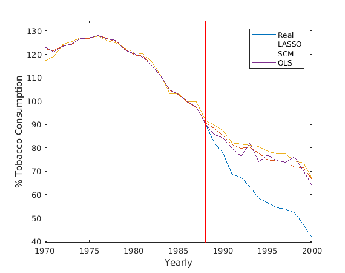

# SCSL

Implementation of standard statistic techniques for synthetic controls (SCSL), see Valero (2015, 2017a, 2017b).

# Functions and scripts

Files:

1. **synth_code.m** --> Main Script that runs the example and reproduces the main
                 results of the paper (the results may differ
                 slighly due to tolerance settings of optimization). 
                 Researchers are encouraged to adjust this code for their
                 needs; please give due credit.

1. **loss_function.m** --> loss function called by synth_code.m

1. **MLAB_data.txt** --> 39 by 39 data matrix to run the example:

                   First row contains state numbers:
                     Alabama 1; Arkansas 2; Colorado 4; Connecticut 5; Delaware 6;
                     Georgia 7; Idaho 8; Illinois 9; Indiana 10; Iowa 11; Kansas 12;
                     Kentucky 13; Louisiana 14; Maine 15; Minnesota 16; Mississippi 17;
                     Missouri 18; Montana 19; Nebraska 20; Nevada 21; New Hampshire 22;
                     New Mexico 23; North Carolina 24; North Dakota 25; Ohio 26; Oklahoma 27;
                     Pennsylvania 28; Rhode Island 29; South Carolina 30; South Dakota 31;
                     Tennessee 32; Texas 33; Utah 34; Vermont 35; Virginia 36; West Virginia 37;
                     Wisconsin 38; Wyoming 39; California 3.
                  Predictors are stored in rows 2 to 8:
                     row 2: income, row 3: retail price, row 4: percent_15-19; row 5: beer
                     consumption (all averaged 1980 to 1988);
                     row 6: smoking 1988, row 7: smoking 1980; row 8: smoking 1975;
                  Outcome Data (smoking consumption in packs per capita) is stored in rows 9 to 39
                     for the years 1970, 1971,...,2000

1. **main_script.m** In this script there is a comparison between OLS, SCM and SLSC, and plot the results.

    1. SCM.m: This function implements SCM.
    
    1. OLS_EST.m: This function implements OLS.

    2. SLSC.m: This function use lasso with cross-validation as in Valero 2015, 2017a and 2017b.
 

# References
* Abadie, A., Diamond, A., & Hainmueller, J. (2010). Synthetic control methods for comparative case studies: Estimating the effect of California’s tobacco control program. Journal of the American statistical Association, 105(490), 493-505. Code in Matlab and R available here: https://web.stanford.edu/~jhain/synthpage.html 
* Valero, R. (2015). Synthetic control method versus standard statistic techniques a comparison for labor market reforms.   https:10.13140/RG.2.1.1301.4486 
* Valero-Fernandez, Rafael. (2017a). Effects from the implementation of the European Road Safety Action Program using Synthetic Control Methods and Interactive Effects using Counterfactual Approaches. https://doi.org/10.5281/zenodo.5830821
* Valero, R. (2017b). Essays on Sparse-Grids and Statistical-Learning Methods in Economics. https://rua.ua.es/dspace/bitstream/10045/71368/1/tesis_rafael_valero_fernandez.pdf 

